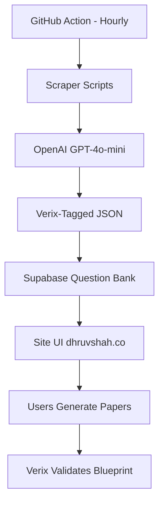

# CBSE Paper Generator — Technical Architecture

## Verix Audit Engine • CBSE 2025-26 Pattern Compliant

---

## 1. System Overview

The system is a fully automated pipeline that scrapes, cleans, tags, and deploys question data. The **Verix Audit Engine** enforces strict CBSE 2025-26 exam blueprints.



## 2. Verix Audit Engine

### What It Enforces

| Subject | Total Q | Total Marks | Sections                                                | Weightage                                                          |
| ------- | ------- | ----------- | ------------------------------------------------------- | ------------------------------------------------------------------ |
| Science | 39      | 80          | A(20×1) B(6×2) C(7×3) D(3×5) E(3×4)                     | Physics:27 Chemistry:27 Biology:26                                 |
| Maths   | 38      | 80          | A(20×1) B(5×2) C(6×3) D(4×5) E(3×4)                     | Geometry:27 Algebra:20 Mensuration:13 NumSys:10 Stats:6 CoordGeo:4 |
| SST     | 37      | 80          | A(20×1) B(4×2) C(5×3) D(4×5) E(3×4) F(1×5 map)          | History:20 Geo:20 Civics:20 Economics:20                           |
| English | 11      | 80          | A(Reading 20m) B(Writing+Grammar 20m) C(Literature 40m) | Reading:20 Writing:20 Literature:40                                |

### Diagram Constraints

- **Science Sec D**: Biology diagrams, Chemistry atomic structures, Physics force vectors
- **Maths Sec D**: Geometry proofs, Mensuration figures (hardcoded)
- **SST Sec F**: Map of India (Climate/Drainage for Geo, French/Russian Rev for History)
- **English Sec B**: Statistical chart/bar graph for Analytical Paragraph

### Database Fields (Verix)

| Field              | Type    | Description                              |
| ------------------ | ------- | ---------------------------------------- |
| `section`          | text    | A, B, C, D, E, F                         |
| `marks`            | integer | 1, 2, 3, 4, 5                            |
| `word_limit`       | text    | "30-50 words", "40 words", etc           |
| `diagram_required` | boolean | true if diagram mandatory                |
| `sub_branch`       | text    | Physics/Chemistry/Biology (Science only) |
| `weightage_area`   | text    | Geometry/Algebra/History/etc             |

## 3. Pipeline Components

### Step 1: The Hunt (Scraping)

- **Script**: `transform_seeds.py`
- **Frequency**: Every hour via GitHub Cron `37 * * * *`
- **Purpose**: Scans for new `seed_*.json` files

### Step 2: The Brain (AI Cleaning + Verix Tagging)

- **Script**: `processor.py` (uses OpenAI API)
- **Purpose**: Extracts questions via GPT-4o-mini with Verix section/marks/diagram classification

### Step 3: The Vault (Supabase Sync)

- **Script**: `sync_to_supabase.py`
- **Purpose**: Atomic `DELETE` + `INSERT` with all Verix fields included

### Step 4: Validation

- **Script**: `validate_paper.py`
- **Purpose**: Checks schema integrity, seed data coverage, and simulates paper generation

## 4. Key Files

| File                     | Purpose                                        |
| ------------------------ | ---------------------------------------------- |
| `verix_schema.json`      | Single source of truth for all exam blueprints |
| `generate_boost_data.py` | Generates Verix-tagged question data           |
| `processor.py`           | AI extraction with Verix field classification  |
| `sync_to_supabase.py`    | Database sync with Verix fields                |
| `validate_paper.py`      | Blueprint compliance validation                |
| `index.html`             | Paper generation UI with weighted selection    |

## 5. Deployment & Setup

### GitHub Secrets

- `SUPABASE_URL`: Your Supabase project URL
- `SUPABASE_KEY`: Your service_role or anon key
- `OPENAI_API_KEY`: For the AI cleaning phase

### Local Commands

```powershell
python generate_boost_data.py   # Regenerate tagged questions
python validate_paper.py        # Validate against blueprint
python sync_to_supabase.py      # Deploy to Supabase
```

---

**Status**: VERIX AUDIT ENGINE v2 • CBSE 2025-26 Pattern Compliant
