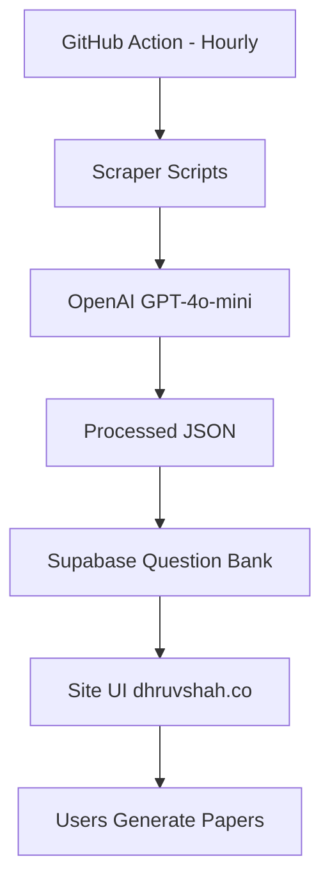

# CBSE Paper Generator — Technical Architecture

This document outlines the **"Pipeline"** methodology for the automated question bank and diagram synchronization.

## 1. System Overview
The system is a fully automated loop that scrapes, cleans, and deploys question data without manual intervention.



## 2. The Pipeline Components

### Step 1: The Hunt (Scraping)
- **Script**: `transform_seeds.py` (Extended)
- **Frequency**: Every hour via GitHub Cron `37 * * * *`.
- **Purpose**: Scans for new `seed_*.json` files or raw URLs from educational sources.

### Step 2: The Brain (AI Cleaning)
- **Script**: `process_data.py` (uses OpenAI API)
- **Purpose**: 
    - Cleans raw question text.
    - Embeds `[Image: URL]` markers into `question_text`.
    - Normalizes subjects/chapters.

### Step 3: The Vault (Supabase Sync)
- **Script**: `sync_to_supabase.py`
- **Purpose**: Atomic `DELETE` + `INSERT` logic per subject to ensure 0% data corruption and fresh papers.

## 3. Deployment & Setup

### GitHub Secrets
To make the pipeline work, the following secrets MUST be configured in your GitHub repository:
- `SUPABASE_URL`: Your Supabase project URL.
- `SUPABASE_KEY`: Your service_role or anon key.
- `OPENAI_API_KEY`: For the AI cleaning phase.

### Local Commands
Run these to manually trigger a sync:
```powershell
python transform_seeds.py
python sync_to_supabase.py
```

## 4. Troubleshooting Diagrams
If diagrams are missing:
1.  **Sync Script**: Ensure `[Image: URL]` is reaching the `question_text` field in Supabase.
2.  **Schema**: Check if the `image_url` column is used as a fallback.
3.  **Key**: Verify the Supabase key in `index.html` is valid.

---
**Status**: ELITE ENHANCEMENT • CBSE 2025-26 Pattern Compliant
